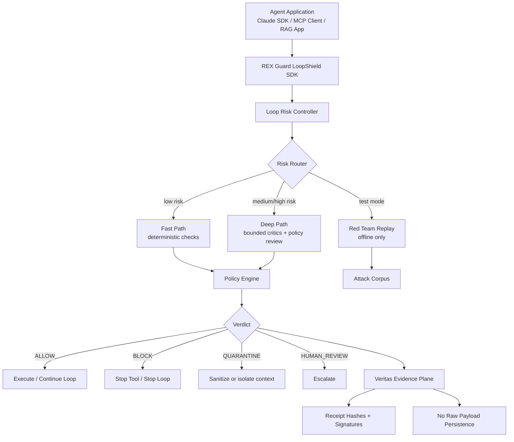

# REX Guard LoopShield SDK

[](https://foundlab.com.br)
[](#repository-contract)
[](#repository-contract)
[](#what-loopshield-does)
[](#threats-covered)
[](#veritas-evidence)
[](#zero-persistence-contract)
[](#license-posture)

> **FoundLab architecture blueprint**
>
> **Product:** REX Guard LoopShield SDK  
> **Category:** agent runtime security for regulated AI workflows  
> **Primary wedge:** prompt injection + tool-call abuse defense  
> **Strategic moat:** Veritas receipts, policy-as-code, attack replay, zero raw-payload persistence  
> **Target:** Claude Agent SDK style loops, MCP tools, Gemini/Vertex AI agents, RAG apps, internal copilots  
> **Status:** docs-first repository blueprint; not production-certified until founder gates pass

---

## Repository Contract

| Field | Value |
|---|---|
| Vendor | FoundLab |
| Product family | REX Guard |
| Module | LoopShield SDK |
| Related module | PromptShield Gateway |
| Buyer | CISO, AppSec, AI Security, Platform Security, Model Risk |
| User | engineers building agents, RAG, MCP clients, regulated copilots |
| First production surface | `PreToolUse` + `PostToolUse` hook enforcement |
| Non-goal | autonomous swarm deciding production approvals |
| Persistence posture | no raw prompt, PII, tool result, or document body persisted |
| Decision posture | fail-closed for sensitive tools and regulated data |
| License posture | proprietary / internal until otherwise decided |

---

## TL;DR

Prompt injection is no longer only an input problem. In agent systems, the attack can arrive at any turn:

```text
prompt → model reasoning → tool call → tool result → context mutation → subagent → MCP resource → final action
```

**REX Guard LoopShield SDK** guards that loop.

It attaches to agent lifecycle hooks, evaluates each prompt, tool request, tool result, subagent spawn, compaction boundary, and final result, then returns a bounded decision:

```text
ALLOW / BLOCK / QUARANTINE / HUMAN_REVIEW
```

The SDK is not magic. It does not predict every attack. It makes each step observable, policy-checked, bounded, and auditable.

---

## Why This Exists

The first FoundLab wedge is **PromptShield**: a runtime shield against prompt injection, jailbreaks, data leakage, and unsafe model behavior.

That is necessary, but incomplete for agents.

Agents introduce new attack surfaces:

- tool calls that write state;
- MCP servers exposing broad capabilities;
- RAG chunks containing hostile instructions;
- subagents inheriting weak policies;
- long loops that drift from the original objective;
- compaction summaries that accidentally preserve malicious instructions;
- permission laundering across multiple safe-looking steps.

LoopShield exists because the correct defense boundary is the **agent loop**, not only the initial prompt.

---

## What LoopShield Does

LoopShield provides SDK-level controls for:

| Capability | Purpose | Runtime status |
|---|---|---|
| Prompt guard | scan initial user/app prompt | P0 |
| Tool-call guard | approve/block requested tools before execution | P0 |
| Tool-result guard | scan tool outputs before they re-enter context | P0 |
| Budget guard | enforce max turns, cost, tool calls, subagents | P0 |
| Subagent guard | restrict spawned agents and inherited tools | P1 |
| Compaction guard | inspect/archive compact boundaries | P1 |
| MCP guard adapter | scope tools/resources exposed by MCP | P1 |
| Veritas receipts | seal decision evidence without raw payloads | P0 |
| Attack replay | convert blocked cases into synthetic regression tests | P2 |

---

## What We Are Not Building

No fairy dust. No security theater.

| Bad idea | Why rejected |
|---|---|
| “Agent swarm approves production calls” | non-deterministic and impossible to audit cleanly |
| SDK bypasses Gateway when Gateway is down | fail-open disguised as resilience |
| Persist raw prompts for later analysis | creates toxic data lake |
| Expose every MCP tool to every agent | capability buffet for attackers |
| Use only regex prompt filters | dies against indirect injection and tool abuse |
| Treat budget only as FinOps | budget exhaustion is also a security attack |

Agents may produce signals. **The Policy Engine has final authority.**

---

## Architecture



---

## Agent Loop Coverage

| Loop phase | Hook / interception point | LoopShield action |
|---|---|---|
| prompt submitted | `UserPromptSubmit` | classify input, hash payload, detect direct injection |
| assistant responds | assistant message stream | observe intent, requested tools, risk drift |
| tool requested | `PreToolUse` | block unsafe tools before execution |
| tool returns | `PostToolUse` | detect tool-result injection before context re-entry |
| subagent starts | `SubagentStart` | enforce inherited policy and tool scope |
| subagent stops | `SubagentStop` | verify output summary before parent ingestion |
| context compacts | `PreCompact` | seal boundary, preserve decisions, drop untrusted instructions |
| session stops | `Stop` | validate final output and seal receipt |

---

## Threats Covered

| Threat | Example | Required control |
|---|---|---|
| Direct prompt injection | “Ignore previous instructions.” | PromptShield |
| Indirect prompt injection | hostile text inside RAG/document/tool output | ContextShield + PostToolUse |
| Tool abuse | model tries to call `send_email` or `transfer_funds` | PreToolUse |
| Data exfiltration | PII routed to external network tool | Tool policy + consent scope |
| Agent-chain abuse | safe step sequence becomes unsafe chain | chain-level policy |
| Subagent drift | child agent gets broader tools than parent | Subagent guard |
| MCP overexposure | too many tools/resources loaded | MCP tool manifest minimization |
| Budget exhaustion | prompt forces recursive analysis/tool calls | max turns/cost/tool cap |
| Compaction poisoning | malicious instruction preserved in summary | PreCompact scan |

---

## Core Runtime Contract

### Input: `LoopEvent`

```json
{
  "decision_id": "dec_...",
  "session_id": "sess_...",
  "loop_turn": 4,
  "phase": "PRE_TOOL_USE",
  "actor": "assistant",
  "policy_version": "banking-br-v1.4.2",
  "tool": {
    "name": "send_email",
    "risk_level": "CRITICAL",
    "writes_state": true,
    "external_network": true,
    "requires_consent": true
  },
  "context": {
    "input_hash": "sha256:...",
    "tool_input_hash": "sha256:...",
    "contains_pii": true,
    "contains_financial_data": true,
    "source": "mcp_tool_call"
  },
  "limits": {
    "max_turns": 12,
    "current_turn": 4,
    "max_budget_usd": 0.1,
    "current_cost_usd": 0.03
  }
}
```

### Output: `GuardDecision`

```json
{
  "decision_id": "dec_...",
  "phase": "PRE_TOOL_USE",
  "verdict": "BLOCK",
  "risk_score": 94,
  "reason_codes": [
    "CRITICAL_TOOL_EXTERNAL_WRITE",
    "CONSENT_SCOPE_MISMATCH",
    "POTENTIAL_DATA_EXFILTRATION"
  ],
  "allowed_next_actions": [
    "ASK_USER_CONFIRMATION",
    "REQUEST_HUMAN_REVIEW"
  ],
  "blocked_actions": [
    "EXECUTE_TOOL",
    "SEND_EXTERNAL_MESSAGE"
  ],
  "receipt_required": true
}
```

JSON Schemas live in [`schemas/`](./schemas).

---

## Minimal SDK Surface

```ts
const rex = new RexGuardLoopShield({
  tenantId: "bank_br_001",
  policyVersion: "banking-br-v1.4.2",
  mode: "ENFORCE"
});

await rex.loop.attach({
  hooks: [
    "UserPromptSubmit",
    "PreToolUse",
    "PostToolUse",
    "SubagentStart",
    "SubagentStop",
    "PreCompact",
    "Stop"
  ]
});
```

Expected methods:

```ts
rex.loop.guard(event: LoopEvent): Promise<GuardDecision>
rex.loop.guardToolCall(event: ToolCallEvent): Promise<GuardDecision>
rex.loop.guardToolResult(event: ToolResultEvent): Promise<GuardDecision>
rex.loop.guardSubagent(event: SubagentEvent): Promise<GuardDecision>
rex.loop.sealTurn(event: LoopEvent, decision: GuardDecision): Promise<VeritasReceipt>
rex.replay.run(policyVersion: string, corpusVersion: string): Promise<ReplayReport>
```

---

## Runtime Modes

| Mode | Use case | Enforcement |
|---|---|---|
| `SHADOW` | observe without blocking | emit findings only |
| `ENFORCE` | production control | block/quarantine/human-review |
| `DEGRADED` | dependency outage | read-only, no PII, no external write |
| `RED_TEAM` | offline attack simulation | no production actions |

---

## Veritas Evidence

Every material loop decision should emit a signed receipt.

The receipt persists only metadata:

- `decision_id`
- `session_id`
- phase
- policy hash
- input/tool/result hashes
- verdict
- reason codes
- timestamp
- signature
- `pii_persisted: false`

The receipt must not persist:

- raw prompt;
- raw retrieved document;
- raw tool output;
- CPF/name/account number;
- secrets/API keys;
- full model chain-of-thought.

---

## Zero-Persistence Contract

| Data | Runtime handling | Persistence allowed |
|---|---|---|
| raw prompt | memory only | no |
| raw tool input | memory only | no |
| raw tool result | memory only | no |
| PII | memory only, TTL-bound | no |
| hashes | durable | yes |
| policy version/hash | durable | yes |
| verdict and reason codes | durable | yes |
| synthetic replay case | durable if scrubbed | yes |

---

## Quickstart Shape

This repository is docs-first. The implementation should start with a narrow adapter:

```text
P0 implementation target:
1. TypeScript SDK shell
2. LoopEvent and GuardDecision schemas
3. PreToolUse enforcement
4. PostToolUse scanning
5. Veritas receipt stub
6. Shadow and enforce modes
7. Unit tests for allow/block/quarantine
```

Example integration sketch:

```ts
import { query } from "@anthropic-ai/claude-agent-sdk";
import { RexGuardLoopShield } from "@foundlab/rex-guard-loopshield";

const rex = new RexGuardLoopShield({
  tenantId: "bank_br_001",
  policyVersion: "banking-br-v1.4.2",
  mode: "ENFORCE"
});

for await (const message of query({
  prompt: "Analyze this customer case and draft a reply",
  options: {
    allowedTools: ["Read", "Grep"],
    maxTurns: 12,
    maxBudgetUsd: 0.10,
    effort: "high"
  }
})) {
  await rex.loop.observeClaudeMessage(message);
}
```

Adapter details are in [`examples/typescript/claude-agent-loopshield.ts`](./examples/typescript/claude-agent-loopshield.ts).

---

## Founder Gates

Do not claim production readiness until these pass:

| Gate | Requirement |
|---|---|
| G1 | `PreToolUse` blocks CRITICAL external write tools without consent |
| G2 | `PostToolUse` detects indirect injection in tool output |
| G3 | no raw prompt/tool result persisted in logs, receipts, or tests |
| G4 | chain-level policy blocks `READ_PII → EXTERNAL_WRITE` |
| G5 | max turns/cost/tool calls enforced |
| G6 | degraded mode cannot call external write tools |
| G7 | receipt is signed and verifiable |
| G8 | attack replay reproduces at least 25 blocked cases |
| G9 | false positives measurable and reviewable |
| G10 | all tests run in CI with coverage gates |

---

## Repo Map

```text
.
├── README.md
├── SECURITY.md
├── CONTRIBUTING.md
├── docs
│   ├── INDEX.md
│   ├── 01-architecture.md
│   ├── 02-agent-loop-integration.md
│   ├── 03-threat-model.md
│   ├── 04-policy-and-permissions.md
│   ├── 05-veritas-receipts.md
│   ├── 06-zero-persistence.md
│   ├── 07-runtime-modes.md
│   ├── 08-api-reference.md
│   ├── 09-testing-and-replay.md
│   ├── 10-roadmap.md
│   └── adr
│       ├── 0001-loopshield-sdk.md
│       └── 0002-no-runtime-agent-swarm.md
├── schemas
│   ├── loop-event.schema.json
│   ├── guard-decision.schema.json
│   ├── veritas-receipt.schema.json
│   └── policy-pack.schema.json
└── examples
    ├── policies
    │   └── banking-br-v1.4.2.json
    └── typescript
        └── claude-agent-loopshield.ts
```

---

## License Posture

Internal FoundLab architecture artifact. Proprietary unless explicitly relicensed.

---

## Veritas Seal

```json
{
  "artifact": "README.md",
  "product": "REX Guard LoopShield SDK",
  "decision": "guard the agent loop, not only the prompt",
  "runtime_scope": [
    "prompt",
    "tool_call",
    "tool_result",
    "subagent",
    "compaction",
    "final_output"
  ],
  "non_goal": "runtime autonomous swarm deciding approvals",
  "status": "docs-first blueprint"
}
```
